<picture>
  <source media="(prefers-color-scheme: dark)" srcset="assets/svg/hero-dark.svg" />
  <source media="(prefers-color-scheme: light)" srcset="assets/svg/hero-light.svg" />
  
</picture>

  

<picture>
  <source media="(prefers-color-scheme: dark)" srcset="assets/svg/about-dark.svg" />
  <source media="(prefers-color-scheme: light)" srcset="assets/svg/about-light.svg" />
  
</picture>

I'm a computer engineer moving from software development into **data science, AI engineering and machine learning**. After building scalable web applications and multilingual platforms at **Ecodation** and **Granobra**, I now focus on bridging robust software architecture with modern AI: **LLMs, RAG pipelines and computer vision**.

<picture>
  <source media="(prefers-color-scheme: dark)" srcset="assets/svg/trajectory-dark.svg" />
  <source media="(prefers-color-scheme: light)" srcset="assets/svg/trajectory-light.svg" />
  
</picture>

  

<picture>
  <source media="(prefers-color-scheme: dark)" srcset="assets/svg/toolkit-dark.svg" />
  <source media="(prefers-color-scheme: light)" srcset="assets/svg/toolkit-light.svg" />
  
</picture>

<picture>
  <source media="(prefers-color-scheme: dark)" srcset="assets/svg/stack-dark.svg" />
  <source media="(prefers-color-scheme: light)" srcset="assets/svg/stack-light.svg" />
  
</picture>

  

<picture>
  <source media="(prefers-color-scheme: dark)" srcset="assets/svg/work-dark.svg" />
  <source media="(prefers-color-scheme: light)" srcset="assets/svg/work-light.svg" />
  
</picture>

  <picture>
    <source media="(prefers-color-scheme: dark)" srcset="assets/svg/project-1-dark.svg" />
    <source media="(prefers-color-scheme: light)" srcset="assets/svg/project-1-light.svg" />
    
  </picture>
  <picture>
    <source media="(prefers-color-scheme: dark)" srcset="assets/svg/project-2-dark.svg" />
    <source media="(prefers-color-scheme: light)" srcset="assets/svg/project-2-light.svg" />
    
  </picture>

  <picture>
    <source media="(prefers-color-scheme: dark)" srcset="assets/svg/project-3-dark.svg" />
    <source media="(prefers-color-scheme: light)" srcset="assets/svg/project-3-light.svg" />
    
  </picture>
  <picture>
    <source media="(prefers-color-scheme: dark)" srcset="assets/svg/project-4-dark.svg" />
    <source media="(prefers-color-scheme: light)" srcset="assets/svg/project-4-light.svg" />
    
  </picture>

 

<picture>
  <source media="(prefers-color-scheme: dark)" srcset="assets/svg/footer-dark.svg" />
  <source media="(prefers-color-scheme: light)" srcset="assets/svg/footer-light.svg" />
  
</picture>

  <a href="https://rana-selim.com"><picture><source media="(prefers-color-scheme: dark)" srcset="assets/svg/btn-portfolio-dark.svg" /><source media="(prefers-color-scheme: light)" srcset="assets/svg/btn-portfolio-light.svg" /></picture></a>&nbsp;<a href="https://www.linkedin.com/in/rana-selim"><picture><source media="(prefers-color-scheme: dark)" srcset="assets/svg/btn-linkedin-dark.svg" /><source media="(prefers-color-scheme: light)" srcset="assets/svg/btn-linkedin-light.svg" /></picture></a>&nbsp;<a href="mailto:rana00selim@gmail.com"><picture><source media="(prefers-color-scheme: dark)" srcset="assets/svg/btn-email-dark.svg" /><source media="(prefers-color-scheme: light)" srcset="assets/svg/btn-email-light.svg" /></picture></a>

